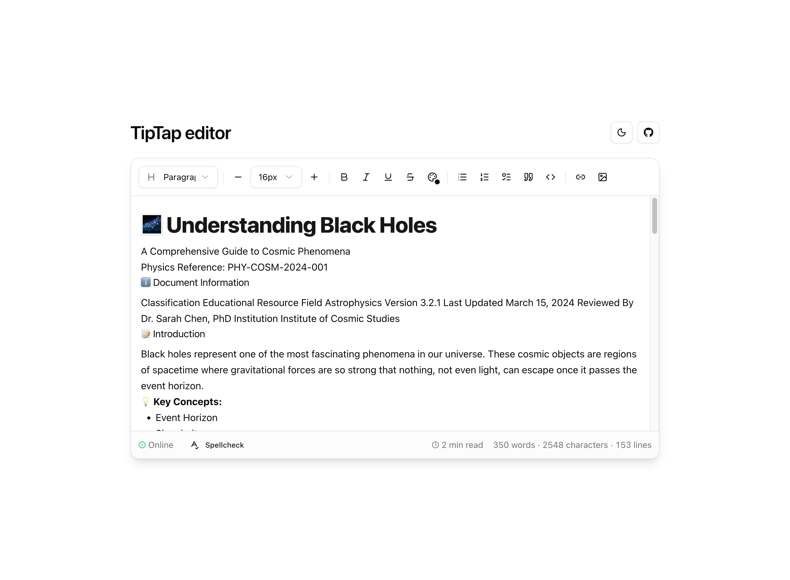

# TipTap editor demo

Demo shell for a **React + TipTap v3** rich-text editor: toolbar (headings, lists, links, images, tasks), **hyperlink popovers** via `@docs.plus/extension-hyperlink`, indent support, and **light/dark** theming (`next-themes`). The sample document exercises formatting so you can evaluate behavior quickly.

<p align="center">
  <picture>
    <source media="(prefers-color-scheme: dark)" srcset="docs/app-screenshot-dark.png">
    
  </picture>
</p>

*Screenshots are full-page captures from `bun run build` + `bun run preview`. Update `docs/app-screenshot-light.png` and `docs/app-screenshot-dark.png` after major UI changes if you want the readme to stay in sync.*

## Stack

| Layer | Choice |
|--------|--------|
| Runtime / package manager | [Bun](https://bun.sh) 1.x |
| UI | React 19, Vite 8, Tailwind CSS 4 |
| Editor | TipTap 3, ProseMirror |
| Quality gate | ESLint, TypeScript (`tsc -b`), Vitest, GitHub Actions |

## Quick start

```bash
bun install
bun run dev
```

Open the URL Vite prints (default `http://localhost:5173`). Production bundle:

```bash
bun run build
bun run preview
```

## Scripts

| Command | Purpose |
|---------|---------|
| `bun run dev` | Development server |
| `bun run build` | Typecheck + production build |
| `bun run preview` | Serve the `dist/` output |
| `bun run lint` | ESLint |
| `bun run typecheck` | TypeScript only |
| `bun run test` | Vitest (single run) |
| `bun run test:watch` | Vitest watch mode |
| `bun run ci` | Lint, typecheck, tests, and build (matches CI intent) |

## Continuous integration

On push and pull requests to `main` / `master`, GitHub Actions runs `bun install --frozen-lockfile`, then **lint → typecheck → test → build**.

## Implementation notes

- **Editor root:** The ProseMirror surface uses a stable `tiptap` class so styles in `src/index.css` stay attached; root attributes are built in one place (`editorSurface`) so spellcheck toggles do not strip that class.
- **Defaults:** Placeholders and sample HTML live under `src/config/` and `src/content/` so the app shell and editor agree on bootstrap content.
- **Hyperlink UI:** Theme tokens `--hl-*` in `src/index.css` map the hyperlink package to your palette; package CSS is imported in `src/main.tsx`.
- **Build:** Production builds emit **hidden** source maps for stack traces without advertising `.map` URLs to browsers.
- **Errors:** `AppProviders` wraps the tree with an error boundary and theme provider.

Optional client configuration: copy `.env.example` to `.env.local` and use **`VITE_*`** names only (values are exposed to the browser).

## License

[MIT](LICENSE). Copyright (c) 2026 Hossein Marzban.

## Publishing this repo on GitHub

1. Create a repository named **`tiptap-editor-demo`** (or rename locally with `git remote set-url`).
2. Optionally add to `package.json`: `"repository"` / `"bugs"` / `"homepage"` pointing at your GitHub URL so npm metadata and the npmjs.com sidebar stay accurate if you ever publish the package.
3. Tag releases with **SemVer**, e.g. `v1.0.0` (see git tags on this repo after the release commit).
