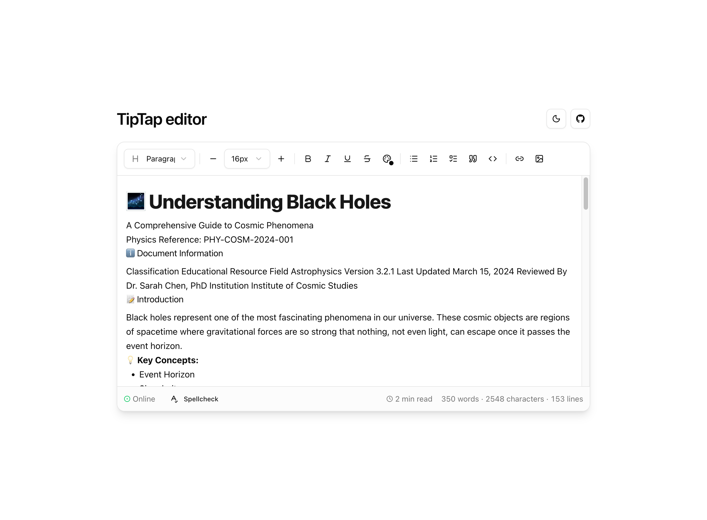

# TipTap editor demo

React + [TipTap](https://tiptap.dev/) v3 demo: toolbar (headings, lists, links, images, tasks), hyperlink popovers, indent, and light/dark theme. The bundled sample document is there to exercise formatting.

**Live:** [hmarzban.github.io/tiptap-editor-demo](https://hmarzban.github.io/tiptap-editor-demo/)

<picture>
  <source media="(prefers-color-scheme: dark)" srcset="docs/app-screenshot-dark.png" />
  
</picture>

## Try it in one minute

1. Open the [live demo](https://hmarzban.github.io/tiptap-editor-demo/) in two tabs in the same browser profile.
2. Type in one tab and watch the change appear in the other. Keep both tabs open; the room has no durable document storage.
3. Select text to add or edit a link, try a task list, then switch the light/dark theme.

The hosted demo syncs same-origin tabs through BroadcastChannel. Different devices need your own signaling or Hocuspocus server; opening the public URL on two devices alone is not enough. For the same local demo, set `VITE_COLLAB=true` in `.env.local` before starting Vite.

## Quick start

Requirements: [Bun](https://bun.sh) 1.x.

```bash
bun install
bun run dev
```

Open the URL Vite prints (default `http://localhost:5173`).

Production build and local preview:

```bash
bun run build
bun run preview
```

For this repo’s GitHub Pages base path, use **http://localhost:4173/tiptap-editor-demo/** after `bun run preview`.

## Stack

Bun, React 19, Vite 8, Tailwind CSS 4, TipTap 3 / ProseMirror. Quality checks: ESLint, TypeScript (`tsc -b`), Vitest, GitHub Actions. Optional realtime editing uses Yjs, **`y-webrtc`** (WebRTC + optional signaling WebSocket), or **`@hocuspocus/provider`** when you set a doc-sync WebSocket URL; see below.

## Optional collaboration

Multi-user editing (shared document, remote carets) can run from a **static** build.

**WebRTC path (`VITE_COLLAB=true`, no `VITE_COLLAB_WS_URL`):** uses [y-webrtc](https://github.com/yjs/y-webrtc). **ICE** uses public **Google STUN** (`stun.l.google.com`). **Signaling** is a **separate** WebSocket service (SDP/peer discovery); **Google does not provide y-webrtc signaling**, and old public relays often return connection errors, so this repo **defaults to no signaling URLs** to keep the console clean.

- **Same browser (multiple tabs / windows):** usually syncs via **BroadcastChannel** without any signaling server.
- **Two phones / two laptops:** you need either **`VITE_COLLAB_SIGNALING`** pointing at your own **`wss://`** server running the y-webrtc signaling binary (`y-webrtc-signaling`, port **4444** by default over `ws://` locally), **or** use **`VITE_COLLAB_WS_URL`** with a Hocuspocus-compatible server instead of WebRTC.

There is **no TURN relay** in this demo; strict NATs may still fail to peer even with signaling.

**Optional doc-sync WebSocket:** set **`VITE_COLLAB_WS_URL`** to a Hocuspocus-compatible **`wss://`** endpoint; then WebRTC is **not** used.

**`VITE_COLLAB_ROOM`** selects the room (optional). Copy **`.env.example`** into **`.env.local`** or set **`VITE_*`** in CI. The **GitHub Pages** workflow sets **`VITE_COLLAB=true`** so the hosted demo enables collab; it does **not** inject signaling URLs (same-browser demo stays quiet; cross-device needs your own `wss` or Hocuspocus).

**Content is not durable**; the default room is shared—treat it as a playground.

## Engineering decisions and scope

The editor extension list is composed in `createEditorExtensions.ts`; UI controls work through TipTap commands while ProseMirror owns document changes. Yjs handles shared state when collaboration is enabled. Provider setup is isolated from the toolbar so the same editor can use WebRTC or a Hocuspocus-compatible WebSocket service.

This repository preserves a tested integration of the dependency versions in `bun.lock`, including its existing docs.plus extensions. It is a focused playground, not a compatibility matrix for every extension release. It has no document database, accounts, authorization layer, or TURN service. Theme preferences can persist locally; document edits do not have a persistence adapter. After every peer closes, a fresh room starts with the sample content.

## Scripts

| Command | Purpose |
| --- | --- |
| `bun run dev` | Dev server |
| `bun run build` | Typecheck + production build |
| `bun run preview` | Serve `dist/` |
| `bun run lint` | ESLint |
| `bun run typecheck` | TypeScript only |
| `bun run test` | Vitest (single run) |
| `bun run test:watch` | Vitest watch |
| `bun run ci` | Lint, typecheck, test, build (same as CI) |

## Continuous integration

On push and on pull requests to `main` or `master`, CI runs `bun install --frozen-lockfile`, then lint, typecheck, test, and build.

## Where things live

- **Editor chrome and extensions:** `src/components/Editor/` (extensions are composed in `createEditorExtensions.ts`).
- **Defaults and sample HTML:** `src/config/`, `src/content/`.
- **ProseMirror root class and attributes:** `editorSurface.ts` and `.tiptap` in `src/index.css`.
- **Collaboration config:** `src/config/collaboration.ts`; shared provider typing in `src/lib/collabProvider.ts`. Only variables prefixed with **`VITE_`** are exposed to the browser.

## License

[MIT](LICENSE). Copyright (c) 2026 Hossein Marzban.
